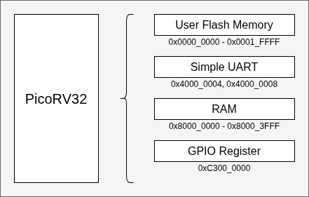

# PicoMAXdev
Development of PicoRV32 on MAX10 using UFM

This project is a basic simple PicoRV32 SoC implementation for the Altera MAX10 FPGA using the User Flash Memory (UFM) for code storage.

This SoC has 4 memory mapped peripherals:

1. 0x0000_0000 to 0x0001_FFFF User Flash Memory
2. 0x4000_0004, 0x4000_0008 Simple UART
3. 0x8000_0000 to 0x8000_3FFF RAM
4. 0xC300_0000 General Purpose Output

## User Flash Memory

A Quartus IP block for the internal User Flash Memory is connected to the PicoRV32 for code and data storage. It is currently implemented read-only, but the hardware can be configured for read/write.  The flash is located at address 0x0000_0000 so that the physical UFM address matches the processor memory map.

## Simple UART

This uses the simple UART from the PicoRV32 project.  This UART only has two registers, a clock divider register to set the baud rate, and a data register.

## RAM

This implementation uses RTL infered block memory for the RAM

## General Purpose Output

A single 32 bit GPO register is connected to up to 8 LEDs depending on the target board.

